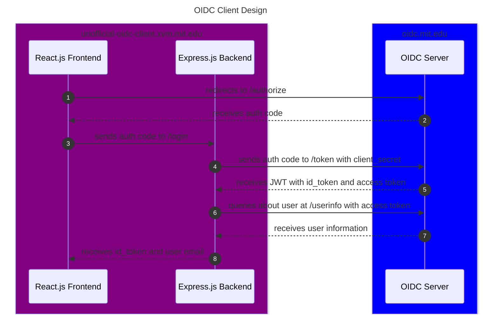

# mit-oidc-client

Unofficial client template for MIT OpenID Connect (OIDC) service

Live example can be found at: <https://unofficial-oidc-client.xvm.mit.edu>

A short presentation summarizing our project can be found [here](https://docs.google.com/presentation/d/1_L9uNqXT8jQCf2XUvjioHke7KBq4loDDfeWcYvIzTNI/edit?usp=sharing).

## Table of Content

- [mit-oidc-client](#mit-oidc-client)
  - [Table of Content](#table-of-content)
  - [Goal](#goal)
  - [What is included?](#what-is-included)
  - [Background](#background)
    - [What is OpenID Connect?](#what-is-openid-connect)
    - [Extension: OpenPubKey](#extension-openpubkey)
    - [Example Application: Authenticated Chatroom](#example-application-authenticated-chatroom)
      - [Other possible OpenPubKey usage](#other-possible-openpubkey-usage)
  - [Related Works](#related-works)
  - [Security Design](#security-design)
    - [Security Discussion of Login System + Authenticated Actions](#security-discussion-of-login-system--authenticated-actions)
  - [Developer Information](#developer-information)
    - [Setup](#setup)
    - [Running Code](#running-code)
    - [OIDC registration + auth configs](#oidc-registration--auth-configs)
    - [Certificates](#certificates)
    - [Hosting](#hosting)
    - [Optional Reading: How our code works](#optional-reading-how-our-code-works)
      - [System Diagram](#system-diagram)
      - [Frontend](#frontend)
      - [Backend](#backend)
    - [Remarks about using MIT email as a unique user identifier](#remarks-about-using-mit-email-as-a-unique-user-identifier)
  - [Future Works](#future-works)
  - [Questions/ Feature Requests?](#questions-feature-requests)


## Goal

We want to provide an easy-to-use template for MIT students looking to develop secure web services that supports MIT Touchstone authentication.

While [supporting documentation](https://ist.mit.edu/oidc) exists to do user authentication using [MIT OpenID Connect](https://oidc.mit.edu/) service, we feel there is a knowledge gap and technical barrier that prevents its widespread adoption. In this project, we hope to provide a simple and secure client implementation that MIT student developers can adopt to quickly get authentication in their web services.

## What is included? 

- Basic template for a **secure web service** containing front-end (React.js) and API back-end (Express.js)
- Features for **integration with Touchstone authentication** via MIT OpenID Connect (OIDC) service
  - Includes code for securely requesting, parsing, and validating OAuth tokens from MIT OIDC
  - Provides logic for how to use those tokens to request information about users
- [**Support developer documentation**](#developer-information) for how to use our template and how OpenID Connect works
- **Implementation of OpenPubKey**, which is a client-side extension that extends the OIDC protcol and adds to its security by allowing for secure signing and verification of messages.
  - As an example usage, we provide a **simple chatroom service** (in /frontend/src/chatroom and /backend/src/chatroom) that uses this feature. Users can verify the signature of messages to check if they actually came from the declared user.

## Background

### What is OpenID Connect?

OpenID Connect is a protocal that builds on top of OAuth2.0. It is important to note the difference between the two. OAuth2.0 provides *authorization*, or permission to access certain resources from one application to another on behalf of the resource owner. On the other hand, OIDC provides *authentication*, or identity of the resource owner. An illustrative guide can be found [here](https://developer.okta.com/blog/2019/10/21/illustrated-guide-to-oauth-and-oidc). The OIDC flow returns an ID Token, which is a JWT that can be decoded to extract authenticated information such as name and email of the resource owner. 

### Extension: OpenPubKey

As an extension to providing authentication via MIT OpenID Connect (OIDC) service, we supply the client with a [PK Token](https://eprint.iacr.org/2023/296) generated from the client's ID Token. The PK Token is a committment of a public/private key pair to the ID Token, which augments the method of authentication from Bearer's Authentication to Proof-of-Possession. This protocol is built upon and is fully compatible with the OpenID Connect service. We will show a possible use case of PK Tokens with an implementation of an authenticated chatroom.

### Example Application: Authenticated Chatroom

**Note:** To access the chatroom, you must login with your MIT credentials through the MIT OpenID Connect service. 

In the authenticated chatroom, we demonstrate how PK Tokens can be use to verify whether data is coming from a trusted user or not, which fundamentally is what authentication is about. In our case, these pieces of data takes the form of a text message and the trusted user is an identity holding an MIT crediential. 

Once logged in using an MIT crediential, the client may utilize methods from our `pktoken` module to generate a PK Token `opkService.getPKToken`, sign messages `opkService.generateOSM`, and verify messages `opkService.verifyOSM`. The user submits an OpenPubKey Signed Message (OSM) consisting of their message and a signture of their message using their PK Token. The authenticated chatroom is designed in a way to allow any users to verify any OSM at any time. All initial messages are unverified (grey check). To verify, click on the check and the verification may either accept (green check) or reject (red exclamation).

#### Other possible OpenPubKey usage

- **Committing bets**: Two friends make a bet on something, and they want to prove they made it with their commitment. Say later one person tries to say they never made this bet, but because they signed their message (which is stored on the server), we have irrefutable proof that they did make the bet.

- **Code signing:** Have a trusted verifier to have mapping of ID tokens to public keys, and then whenever a user signs a commit they made, they can send it to the verifier and have it put into an append-only log.

- **SSH:** SSH keys are difficult to manage. Instead, have users sign in through Google (or some other OpenID provider), and then have a PK Token that can act as their public SSH key.

## Related Works

At MIT, there are multiple authentication systems and methods that are frequently used. Each of them offers their own strengths and drawbacks, which we will summarize below:

1. [**Touchstone**](http://kb.mit.edu/confluence/display/istcontrib/Touchstone+Landing+Page) is MIT's proprietary implementation of the Shibboleth system, which offers a **single sign on system (SSO)** for web applications. It is the most *flexible*, allowing users to either log with MIT certificate, kerberos, or a Collaboration account (for non-MIT collaborators). However, Touchstone requires special software (namely Shibboleth SP packages), and custom configuration changes to run, and are largely seen in MIT-controlled websites and the IS&T wiki.
2. [**Shimmer**](https://tig.csail.mit.edu/accounts-authentication/oidc/) is CSAIL's implementation of the Touchstone system integrated with OpenID Connect (OIDC). While it utilizes OpenID Connect, its usage is limited to CSAIL services and CSAIL account holders, which makes it unavailable for MIT students to use more widely. Its main issues are that the servers running the system seem to somewhat unreliable, causing unexpected timeout issues at different times of the time. Students have also complained about its difficult-to-read documentation and lack of example client as reasons hindering its adoption.
3. **MIT OpenID Connect Pilot (OIDC)** is run by MITRE as part of a collaboration effort with MIT KIT starting in 2014, and is also based on the OpenID Connnect protocol. This service also offers a dynamic registration endpoint like Shimmer, except it is open to use by anyone at MIT with a Touchstone account. 
4. **Certificates**, namely MIT X.509 client certificates, are frequently used as a standalone authentication option for some MIT web services, including ones hosted on [Scripts](https://scripts.mit.edu/) - a popular MIT hosting service made by SIPB for students to use. The main issue with having certificates as the standalone certification option is that it is difficult to install certificates on mobile devices, and are not very extensible to MIT student web services running on third-party hosting solutions like Heroku, Render, or standalone VMs.

Out of the auth systems we surveyed, **MIT OIDC** seems to be the most promising, and is why we chose it as the target system for this project. Not only is MIT OIDC the recommended authentication system by IS&T (see [here](http://kb.mit.edu/confluence/display/istcontrib/Authentication+Tools+at+MIT)), its current issues seem to be with lack of student awareness about its existence and lack of an easy-to-use client implementation rather than limitation sy the system itself. 

Since OpenID Connect is a well-known protocol, open-source clients for it have been written, including:

- [**oidc-client-ts**](https://github.com/authts/oidc-client-ts) is a Typescript library that provides OIDC and OAuth2 support for browser-based client applications. The main issue we found with this template is that since all code is executed on the client side, it requires storing the `client_secret` in the frontend code. Because browsers are *public clients* (see [Confidential vs. Public client](https://www.youtube.com/watch?v=5cQNwifDq1U)), there is no way to guarantee the security of the secret. To fight against this, `oidc-client-ts` implements the **PKCE** extension, which came as part of the OAuth 2.0 protocol, and replaces the client_secret with a random string generated by the application for every auth code submission. Unfortunately, the MIT OIDC service does not currently support this extension, and without it, auth systems using this library would be vulnerable to impersonation attacks and potential leaks of user's data.
- [**passport-mitopenid**](https://github.com/robertvunabandi/passport-mitopenid) is a project written by a MIT student in 2018 that implements a sample Node.js application that works with MIT OIDC service using Passport.js. This project is very similar to [node-openid-client](https://github.com/panva/node-openid-client), which is the official package (certified by OpenID) for implementing OpenID Client and Relaying Party in Node.js applications. However, for both libraries, it is an incomplete solution, since they are intended for web applications running solely on Node.js, whereas for our solution we want to have an integrated authentication workflow between an Node.js backend and a frontend running a web framework like React.js.

## Security Design

To ensure the security of our overall client framework, we made the following design choices:

- **HTTPS** is required in development for both the front-end and back-end
  - HTTPS/SSL encryption ensures all communication between the user and the web service is protected. This is a hard requirement for safe-handling of OAuth ID and access tokens
  - **Note:** Self-signed certificates should be used for development work **only**. We recommend using Let's Encrypt or other reputable certificate authority when deploying to production. If you're using platforms like Heroku or Render.com for hosting, they often will have their own SSL certificates management services. See [this](https://devcenter.heroku.com/articles/automated-certificate-management) and [this](https://render.com/docs/tls).
- Dependency on **secure cryptographic libraries**
  - When generating randomness or relying on cryptographic primitives like hash functions, we use secure libraries like built in browser's `Crypto.getRandomValues()` and `Crypto.subtle.digest()` functions, along with official JWT libraries. This ensures that we are generating secure randomness in our application and depends only on secure primitive implementation for signing and verification of data.
- Utilization of **state and nonce** in authorization request
  - As part of the [OpenID Connect Basic Implementer's Guide 1.0](https://openid.net/specs/openid-connect-basic-1_0.html), it is optional, but recommended to implement the state and nonce parameter in the authentication request flow. The state parameter is used to mitigate against Cross-Site Request Forgery (CSRF, XSRF) attacks, and the nonce parameter mitigate replay attacks.
  - For our application, we decided to implement both of these variables, storing them in as a variable in localStorage and a cookie, respectively. Both contain high levels of entropy (2^128) for security. **Note:** In the optional OpenPubKey flow, the nonce is replaced by a different format than a random string. See the [original paper](https://eprint.iacr.org/2023/296.pdf) for arguments about its security.
- **Secure handling of cookies**
  - Whenever cookies are used in our implementation, namely the state parameter, we secure it by setting security parameters including:
    - `path`: Restrict sending the cookie to a specific API endpoint on the backend only
    - `sameSite`: Disallow sending cookie on cross-site requests
    - `secure`: Force cookie to be sent over secure connections (HTTPS)
- Safe type checking using **Typescript**
  - At MIT, especially in course 6.031, we promote the user of Typescript over Javascript because it allows for static typing, which helps code be more readable, bug-safe, and more easily maintainable. It's also the language of choice for most MIT students creating web services.

### Security Discussion of Login System + Authenticated Actions

An important thing to note is that in our example React app, we require the user to authenticate to be able to access the content of the "Protected" page. However, this measure simply *hides* the chatroom React component, but **doesnroot directory't actually prevent a malicious user from sending messages to the backend**. 

For example, a bad actor can call the `auth.signin()` function themselves in the browser's console, provided with a fake email to simulate a user login and see the chatroom. Alternatively, they can directly send a POST request to the backend `/api/messages` endpoint with a message of their choice.

Thus, it's important when developing an app that has a login system such as this one that you have a method of authenticating user actions *after* they have logged in. Indeed, in our [Future Works](#future-works) section, we discuss the use of adding a session management system that allows for the backend application to keep track of logged in users via **session cookies** and verify that a user provide a valid session cookie whenever they want to perform an authenticated action.

## Developer Information

### Setup

Install:

* Node.js 16, at least Node 16.16.0

### Running Code

In either the backend or frontend folder, run:

* `npm install` to install dependencies
* `npm run build` to create build production 
* `npm run start` to run code locally (for development purposes)

When deploying to production, you should build your code using `npm run build` for both the frontend and backend so that it's optimized for performance. You should then use a web server like Nginx to serve your static frontend files and a process manager for Node like `pm2` to run your backend server (don't run against Node directly!).

### OIDC registration + auth configs

First thing you will need to do is to register your web app with the MIT OIDC service, and update the corresponding values in `authConfig.ts`.

One of the advantages of OpenID Connect protocol is that third-party applications like ours can register to use the OIDC server dynamically without needing to be pre-approved. For the MIT OIDC service, navigate to <https://oidc.mit.edu/> and log in to your Touchstone account. Then on the left hand side, click on `Self-service client registration` -> `Register a new client`. 

You will need to supply fields for: Client name, redirect URIs, application type (choose `web` if you are using this template), and contacts. For example, in our live server, we had:

- Client name: `unofficial-oidc-client`
- Redirect URIs: `https://unofficial-oidc-client.xvm.mit.edu/oidc-response`
- Home page: `https://github.com/mit-oidc-client/mit-oidc-client`
- Application Type: `web`
- Contacts: `unofficial-oidc-client@mit.edu`

Once you click save, it will generate the client ID + secret, as well as other fields, for your application. **Be sure to save this information somewhere safe!** To work with our template, you will need to navigate to the `JSON` tab and save the json there as a `secrets.json` file stored in the `cert` folder of the github repo. This JSON is read by the Express backend to access the `client_secret` parameter, which is needed as part of the authorization code flow.  

Also, in the future, when you want to edit your application's info again, you will need the `client_id` and `registration_access_token` to get access. Otherwise, your information is essentially lost and you will need to register again (it's possible to re-register for the same domain).

Once you done so, you will also need to **edit the `authConfig.ts` file in both the frontend and backend code**. This file is stored under the `auth` folder, and contains information used by the application to run your auth endpoints. Things you will need to edit:

- `DOMAIN_URI`: Domain name of your application (no trailing slash)
- `client_id`: Client ID given to you from OIDC
- `scope` (optional): If you want to access other user information in addition to "email". **Note:** This will require further modification in the backend + frontend code if you want to query for other information about the user such as full name or kerberos. Please contact a member of our team if you want help implementing this modification.


### Certificates

To secure the frontend and backend, you will need to use SSL certificates. For production, you should acquired certs from a trusted CA like Let's Encrypt.

For development work ONLY, you can generate self-signed certificates. See the following [guide](https://www.makeuseof.com/create-react-app-ssl-https/) to use `mkcert` utility. The certificates should be saved to the [/cert](/cert/) folder, with SSL secret key file named `key.pem` and public certificate file named `cert.pem`.

On our live example, we used Let's Encrypt Certbot tool configured for Nginx for the acquiring and the auto-renewal of TLS certificates.

### Hosting

Our client implementation does not require a specific hosting solution, and indeed you can deploy it on platforms like Heroku and Render.com, or MIT-specific hosting services like [XVM](XVM.mit.edu) offered by the [Student Information Processing Board (SIPB)](https://sipb.mit.edu/). Indeed, Heroku and Render.com offers fully managed TLS certificates to allow for HTTPS encryption.

For our purposes, we hosted our example website on an Ubuntu 18.02 VM running on SIPB's XVM service. We use Nginx as our web server and reverse proxy with TLS enabled, and `pm2` as the process manager for the Express backend.

### Optional Reading: How our code works 

In this section, we'll break down how our frontend and backend work together to provide the OIDC client implementation. Note that this does not cover the OpenPubKey-specific details.

#### System Diagram

The follow diagram summarizes our system interactions between the frontend, backend, and the OIDC server:



#### Frontend

The primary structure of our frontend code is as follows:

```js
    <AuthProvider>
      ...
      <Routes>
      <Route element={<Layout />}>
        ...
        <Route path="/login" element={<LoginPage />} />
        <Route path="/oidc-response" element={<OidcResponseHandler />} />
        <Route
          path="/protected"
          element={
            <RequireAuth>
              <ProtectedPage />
            </RequireAuth>
          }
        />
      </Route>
      </Routes>
    </AuthProvider>
```

In App.tsx, we define an auth context manager `<AuthProvider>`, which keeps track of the current logged in user. It provides a property `auth.user` through `useAuth()`, which stores the email of the current user as a string. Default value is an empty string.

To prevent displaying of certain component(s) until the user is logged in, we wrap them with `<RequireAuth>`. In this case, we want to hide the `<ProtectPage>`, which contains the chatroom. As noted in the [security discussion](#security-discussion-of-login-system--authenticated-actions), this only prevents browser rendering, but any actions done using these components need to be further authenticated in the backend (preferably using some form of user-identifiable session cookies).

In our frontend code, we provide two React router paths, namely `/login` and `/oidc-response`, to handle the OIDC logic workflow.

1. `/login` handles the redirect from the current website to the OIDC's authentication endpoint. It supplies the client_id and redirect_uri to the OIDC server (in addition to other required fields) as query parameters. 
2. Once the user successfully authenticates to the OIDC server, they are redirected to the `/oidc-response` endpoint on the webpage. The browser takes in the authorization code in the URL, verifies the returned state parameter is correct, and forwards the auth code to the backend using the backend's POST `/login` API endpoint.
3. The backend returns a response of type `loginResponse`, which looks like the following:
  
    <br/>

    ```js
    interface loginResponse {
        success: boolean; //Whether or not the login succeeded
        error_msg: string; //If failed, provide error message. Else, empty string.

        //If success, these values should be populated. Else, empty string.
        id_token: string;
        email: string;
    }
    ```

    The frontend then checks the `success` parameter. If it is true, then it stores the `id_token` to localStorage and signs the user in with `email` using the `auth.signin()` function. Otherwise, it outputs the error message to the user via the `OidcResponseHandler` React component.

4. The webpage then reloads to show a `Welcome user_email@mit.edu!` message at the top (via `<AuthStatus/>` component), along with a signout button. The user can then access the Protected page, which in this case allows them to interact with the OpenPubKey-enabled chatroom. 

#### Backend

The Express.js backend requires only one API endpoint for OIDC, which we define as a POST request.

```js
app.post("/api/login", handleLogin);
```

The `/api/login` takes in a `code` parameter in the request body, along with a nonce cookie named `oidc-request-nonce`. All server responses will be objects of type `loginResponse` (as defined above). In the normal case, it will return the user's ID token and their email. In the case that something fails to validate, instead of a 404 error we will return a descriptive error message that the frontend can then display to the user. Whether the login operation succeeds or fails is denoted by the "success" boolean parameter.

**/api/login Workflow:**

The server takes the `code` variable and sends it to the `/token` endpoint on the OIDC server to exchange for an ID token. It also includes the `client_id` and `client_secret` as HTTP Authorization Headers, along with a fixed `grant_type` and `redirect_uri`.

**Note:** This step is the reason why the ID token exchange is done on the backend (which is considered a confidential client), rather in the frontend (considered a public client), because we want to keep the application's client secret safe. See the [Related Works section](#related-works) on why we view this to be necessary.

Following that step, the backend server receives back an JSON object containing the ID token from the OIDC server, which it then validates thoroughly. The checks are as follows:

1. Verify that the JSON object contains the necessary `id_token` and `scope` parameters. As part of the OpenID Connect protocol, it is possible for a user to successfully authenticate to the OpenID provider, but chooses to deny some or *all* of the requested scopes asked by the application. For our model, since the ID token and access to user's email is the bare minimum we need for our authentication process to work, we return with error message if `openid` or `email` scope is not provided.
2. Verify the `token_type` is of value "Bearer"
3. The ID token is then taken from `id_token` field in the JSON object and has its signature validated. This is done by fetching the public key of the OIDC server at `/jwk` endpoint, convert it to PEM format, and using `jwt.verify()` from the jsonwebtoken library to verify the JWT's signature. The values from the ID token are then exposed to us as a return value of this call.
4. We then check the `iss`(issuer) of the ID token is `https://oidc.mit.edu`, and that `exp` (expiration time) and `iat` (issued time) are correct relative to the current time. 
5. We then verify our client_id is included as part of the `aud` list, and that the `nonce` in the ID token matches the `nonce` cookie sent by the browser.

Once we can be sure the ID token is valid, we proceed with querying the `/userinfo` endpoint on the OIDC server for user information. Since we're solely interested in determining who the user that just logged in is, we decided to query for the `email` field. This action is done by the `getUserInfo()` function, which simply returns the user's email (or an error message if the lookup fails).

The backend then bundles the ID token together with the user email, and sends it back to the user's browser.
### Remarks about using MIT email as a unique user identifier

It should be noted that in the [IS&T documentation about OIDC](https://kb.mit.edu/confluence/display/istcontrib/Logging+in+Users+to+your+application+using+OpenID+Connect), they remark neither the the `email` (MIT email) or `preferred_username` (MIT kerb) are sufficient to be used as a globally unique identifier for the current user across all OIDC servers because they can change over time. However, we believe it's impractical to use the recommended pair of `iss/sub`, because while it is guaranteed to be unique, the web application still needs a way to be able to convert `iss/sub` into an email or some other MIT identifying string.

While in theory it's possible to do by storing an `access_token` and `refresh_token` with the `iss/sub` pair and then querying them for the user's email or kerb whenever we need it, it adds additional complexity to the authentication system and requires an identity storage, which is something that we strongly want to avoid or at least keep to a minimum. We can also see issues with student developers then adding some form of caching methods to speed up identity lookups, where they store the `iss/sub` to `email` mapping in a local database, which then opens up additional attack surfaces and potential data leakage. 

Indeed, we are considering switching the use of the `email`  to `preferred_username` as the main identifying field, since a user's kerberos is much more unlikely to change over the course of them being a student or MIT community member compared to their email (see [Name Changes at MIT](http://kb.mit.edu/confluence/display/mitcontrib/Name+Changes+At+MIT)). 

## Future Works

While we were able to achieve many of the original goals set out for this project, we recognize that there are aspects which could be further improved and developed on for our client framework. 
 
1. **Security analysis of our code:** 
    * We recognize that code is rarely bug-free and secure the first time it is written. Before publishing our code to the MIT community, we would like to have it reviewed by other students, and members of the the MIT OIDC team, for potential bugs and security issues. 
2. **Advertisement to students**: 
    * A big motivation for us in creating this project is that we want for MIT students to actually be able to use this code when creating their web services. As a result, we plan to advertise our project through dormspam and get in contact with professors + TA's teaching web development class like web.lab to see they can mention it to their students. We also want to get feedback on how we can best enable the  adoption of our authentication framework into existing services (rather than just new ones).
3. **Communicate server timeout issues to MIT OIDC**
    * As part of our initial survey and design work, we discover that one of the pain points reported by students when using the OIDC authentication service is that the login endpoint tends to have long delays at random times of the day (to the point of causing timeouts). We also encountered this issue multiple times in the development of this project. As a result, we plan to follow up with the MITRE team who created the MIT OIDC service service to get their help on resolving this issue. 
4. **Add session management for users**
    * One quality-of-life feature we would like to add to our OIDC client is the ability to create and manage sessions for logged in users. Currently, our system provides a way of authenticating users to the application, but it doesn't offer a generic way of tracking/authenticating actions done by that user after a successful login, outside of the OpenPubKey OSM messages. We would like to add a secure session management scheme, likely using libraries like `express-session` or `cookie-session`.
5. **Add MFA cosigners and better expiry to OpenPubKey extension**
    * TODO

## Questions/ Feature Requests?

Contact us at [unofficial-oidc-client@mit.edu](mailto:unofficial-oidc-client@mit.edu).
